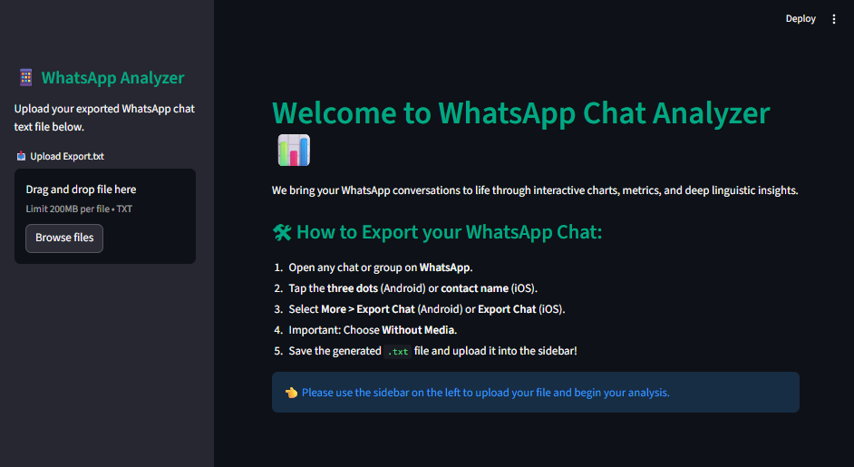
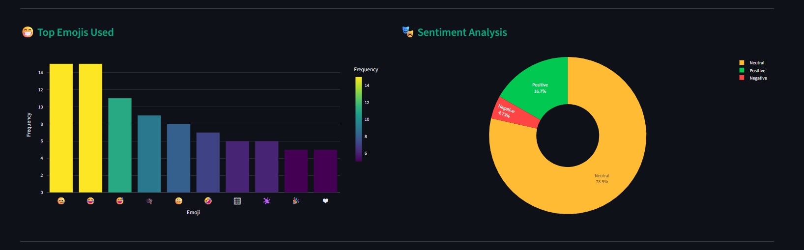
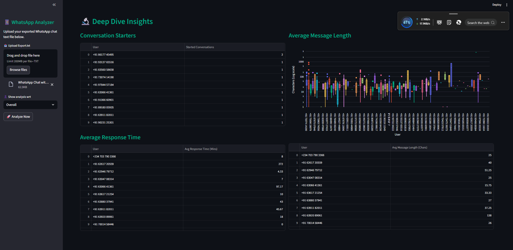

# 📊 WhatsApp Chat Analyzer

A powerful **WhatsApp Chat Analyzer Dashboard** built using **Python and Streamlit**.
This application allows users to upload exported WhatsApp chats and visualize detailed insights such as activity trends, emoji usage, sentiment analysis, and more.

The dashboard automatically processes the chat data and provides **interactive analytics and visualizations** to understand conversation patterns.

---

# 🚀 Features

### 📈 Chat Statistics

* Total messages
* Total words
* Media shared
* Links shared

### 📅 Timeline Analysis

* Monthly message timeline
* Daily activity timeline

### 🗓 Activity Insights

* Most busy day
* Most busy month
* Weekly activity map
* Activity heatmap (Day vs Hour)

### 👥 User Analysis

* Most active users
* Percentage contribution of users

### 😀 Emoji Analysis

* Most used emojis
* Emoji distribution charts

### ☁ Word Analysis

* Wordcloud generation
* Most common words used in chat

### 🧠 Advanced Insights

* Conversation starter analysis
* Average response time analysis
* Message length analysis
* Sentiment analysis (Positive / Neutral / Negative)

---

# 🖥 Dashboard Preview

## 📊 Main Dashboard


## 😀 Emoji Analysis


## 📊 User Activity Distribution


## 🔍 Deep Dive Analytics


## 🖥 Dashboard Inside View


---


# 🛠 Tech Stack

* Python
* Streamlit
* Pandas
* Plotly
* Matplotlib
* Seaborn
* WordCloud
* TextBlob (Sentiment Analysis)
* Emoji Library
* URLExtract

---

# 📂 Project Structure

```
whatsapp-chat-analyzer
│
├── app.py
├── helper.py
├── preprocessor.py
├── requirements.txt
├── stop_hinglish.txt
│
├── images
│   ├── dashboard.png
│   ├── emoji_analysis.png
│   ├── wordcloud.png
│   ├── heatmap.png
│   ├── active_users.png
```

---

# ⚙️ Installation

Clone the repository

```
git clone https://github.com/codewithvishuuu/whatsapp-chat-analyzer.git
```

Move into project directory

```
cd whatsapp-chat-analyzer
```

Install dependencies

```
pip install -r requirements.txt
```

Run the Streamlit app

```
streamlit run app.py
```

---

# 📥 How to Export WhatsApp Chat

1. Open WhatsApp
2. Open the chat you want to analyze
3. Click **More Options (⋮)**
4. Select **Export Chat**
5. Choose **Without Media**
6. Upload the `.txt` file in the dashboard

---

# 🌐 Live Demo

Deploy the project using **Streamlit Cloud**

```
https://share.streamlit.io
```

---

# 🔮 Future Improvements

* AI powered chat summarization
* Topic detection using NLP
* Relationship interaction graph
* Chat sentiment trends over time

---

# 👨‍💻 Author

**Vishal Kumar**

GitHub:
https://github.com/codewithvishuuu

---

⭐ If you found this project helpful, please consider **starring the repository**.
